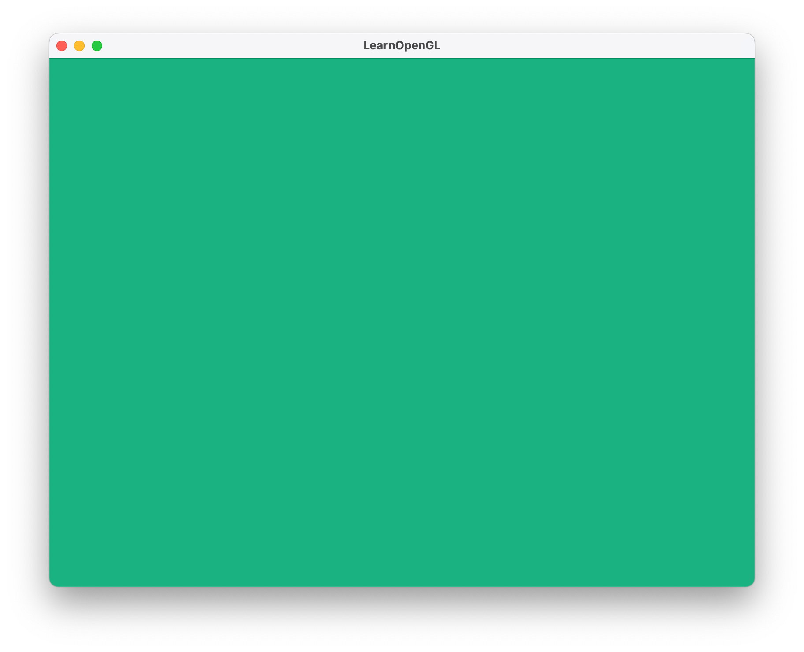
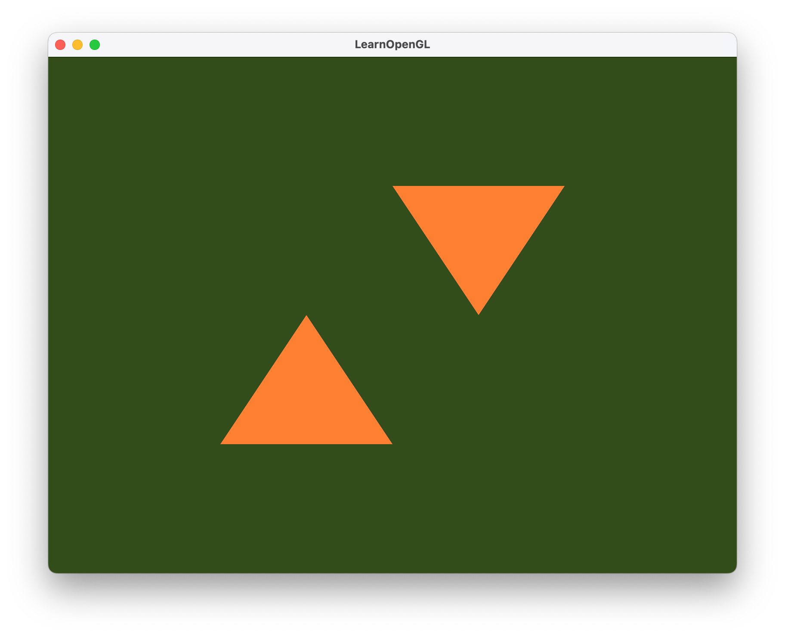
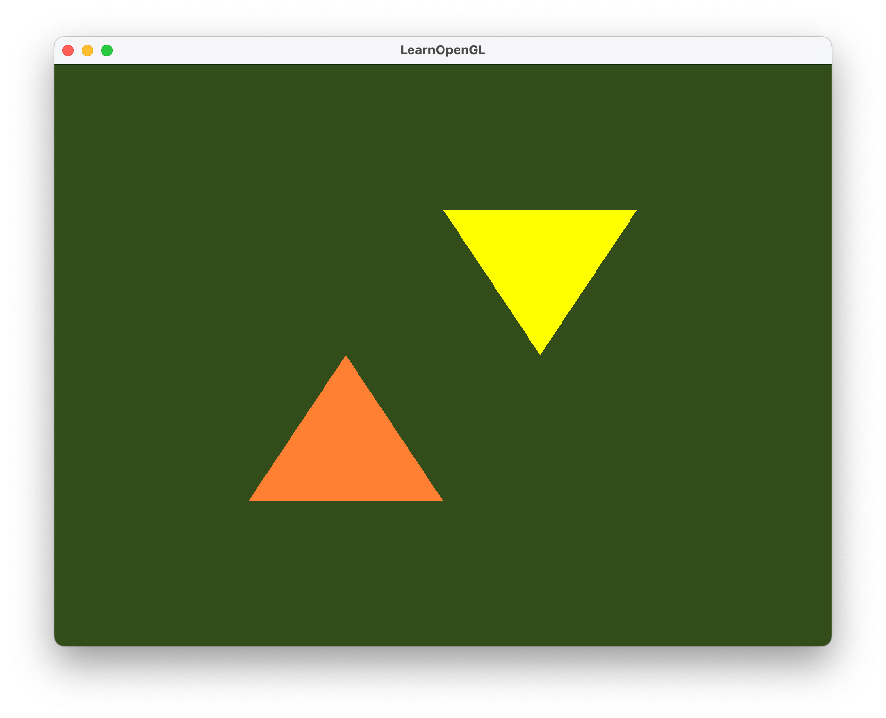
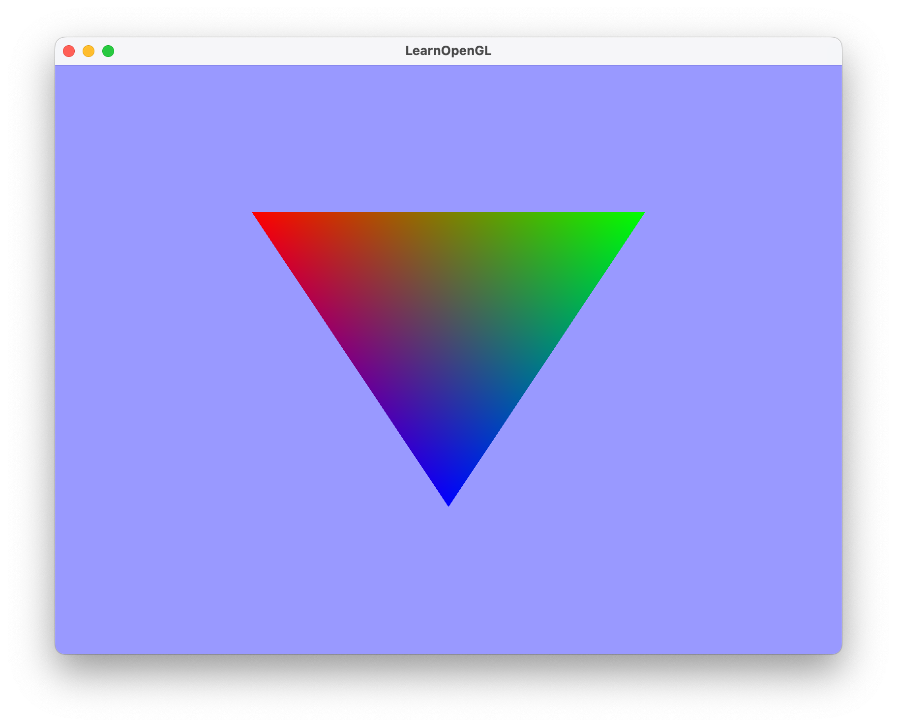
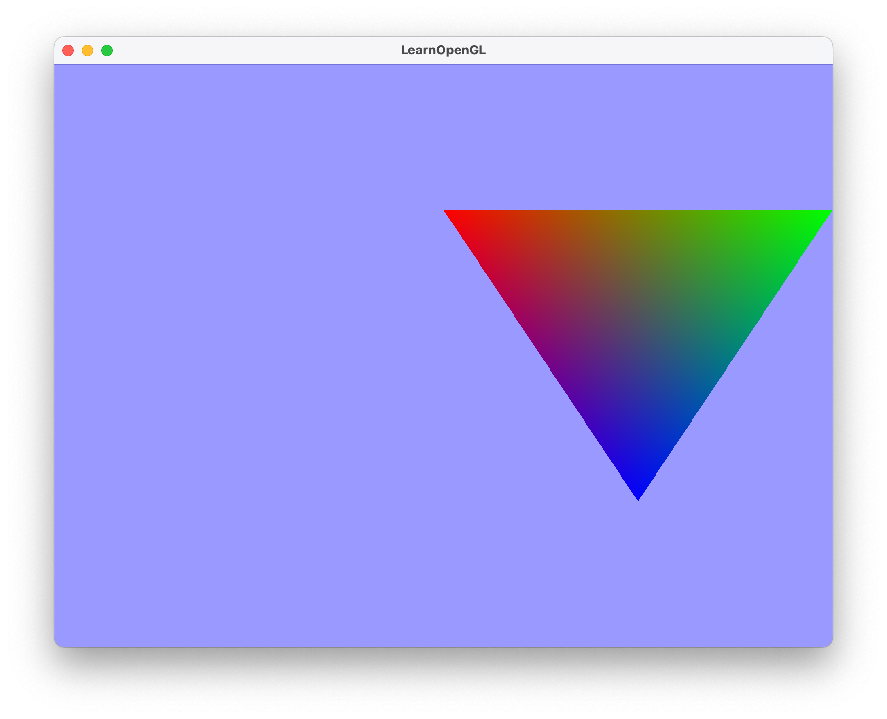
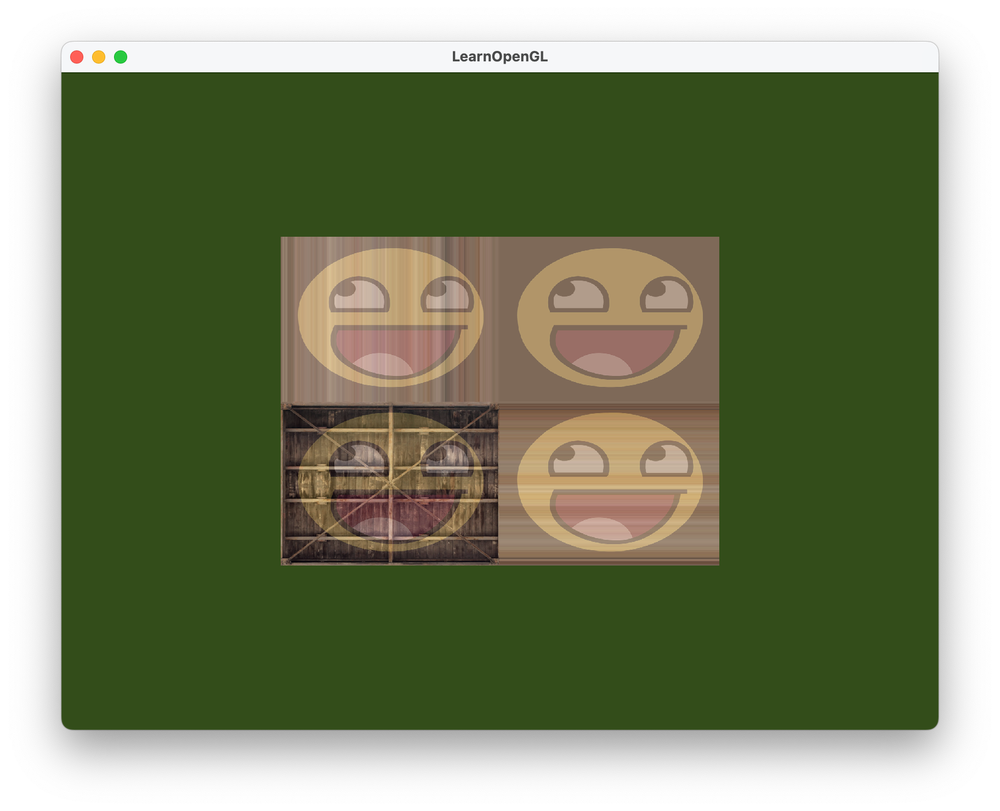
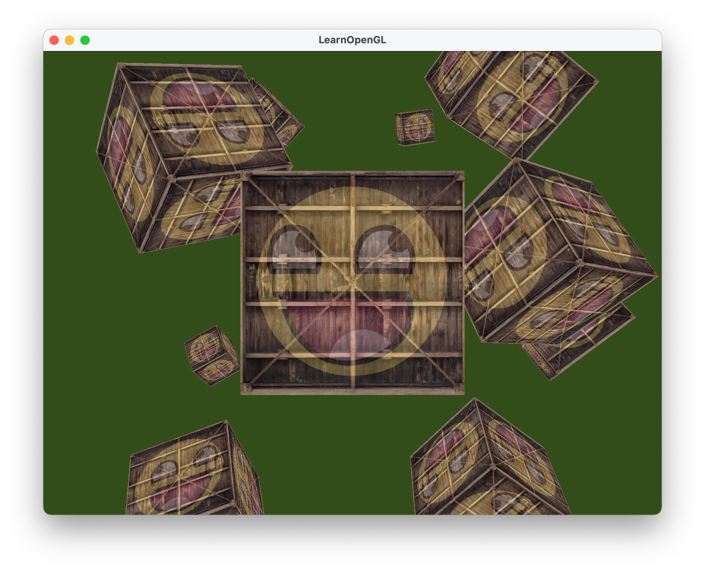

# learnopengl.com
Projects and exercises from [learnopengl.com](https://learnopengl.com)

## Basics

MacOS was used with this [boostraped basic project.](https://github.com/st235/learnopengl-macos-bootstrap)

## Getting started

| Lesson | Description | Scr. 1 | Scr. 2|
| ----- | ----- | ----- | ----- |
| 04. Hello Window | |  | |
| 05. Hello Triangle | |  |  |
| 06. Shaders | |  |  |
| 07. Textures | |  |  |
| 08. Transformations | |  |  |
| 09. Coordinate Systems | |  |  |
| 10. Camera | |  |  |

## Lighthing

